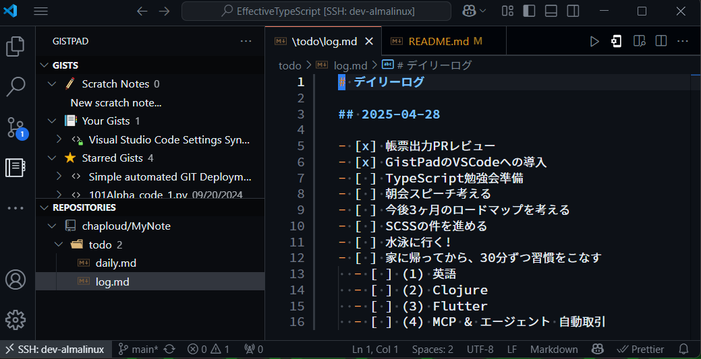

# LT

## 2025-04-14 (月)

### VSCodeにおけるGitHub Copilotの各機能 (工藤)

- Copilotによるコード補完
- Copilot Chat
  - 質問
  - 編集
  - Agent
    - いずれもコンテキスト追加することで精度を上げることができる
    - TIPS: (私の環境では)
      - `Enter` で開いているファイルのカーソルあたりのコードを参照
      - `Shift + Enter` で改行
      - `Ctrl + Enter` で開いているプロジェクト全体を参照
        - lmsだとでかすぎて重い
- インラインチャット
  - エディタ中で `Ctrl + I` その周辺だけで相談・編集できる
- ターミナルでのインラインチャット
  - ターミナル内で `Ctrl + I`
  - ファイル操作や検索をどうやったらできるかな？というシチュエーションにおいて便利
- コミットメッセージの記述
  - ソース管理の星アイコンをクリック
- Copilotにどんな機能があるか調べる
- `Ctrl + Shift + P` でコマンドパレットを開く
  - `copilot` と入力してみる
- `Ctrl + ,` で設定を開く
  - `copilot` と入力してみる

### 他の方の活用

- コマンドラインのCopilotが便利そう
- 知らないことが多かった!

## 2025-04-21 (月)

### XXX1 (武村)

## 2025-04-28 (月)

### XXX2 (武村)

### GistPad(VSCode拡張機能)の紹介 (工藤)

- Gistと連携してメモを常に同期できる(会社でも自宅でも)
- Scratch Notesでパッと日付付きのメモ作成
- 特に、自分のプライベートリポジトリなどにメモを貯められる機能が嬉しい(保存するだけでコミット)
- 左端のアクティビティバーにGistPadアイコンが常駐し、VSCodeを離れずにメモを取れるのがありがたい
